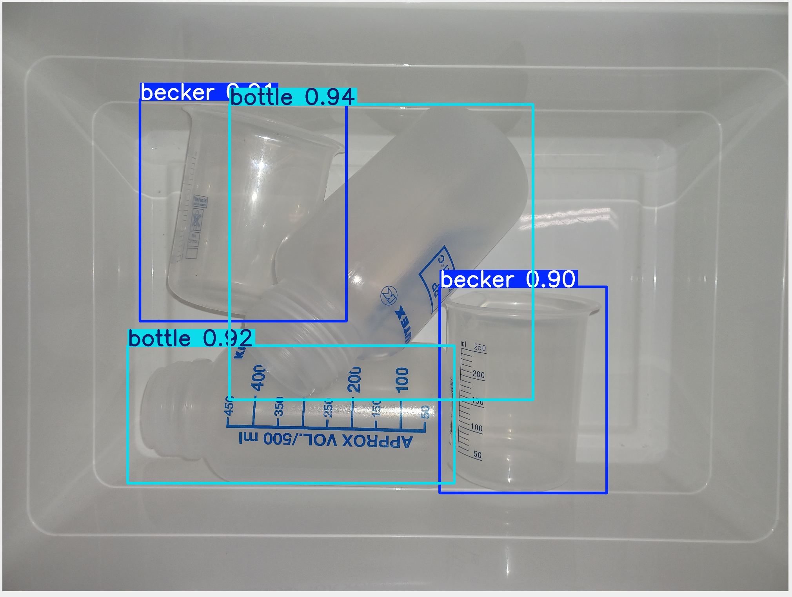
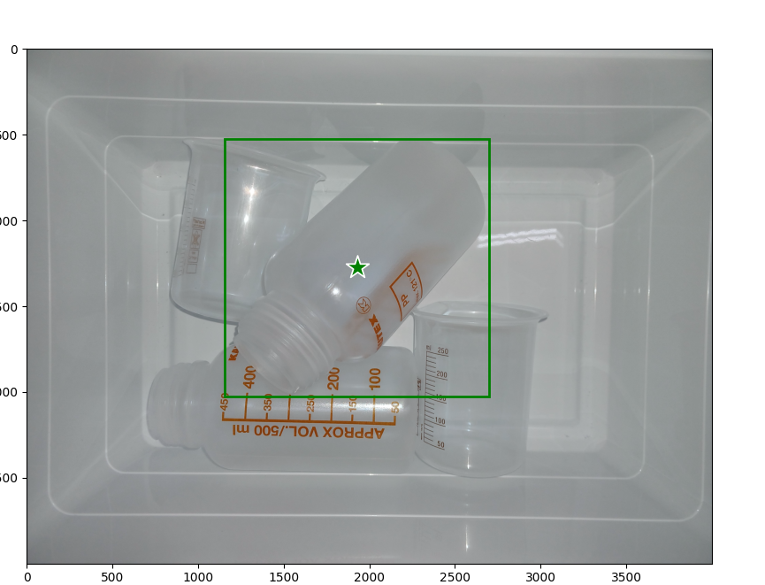
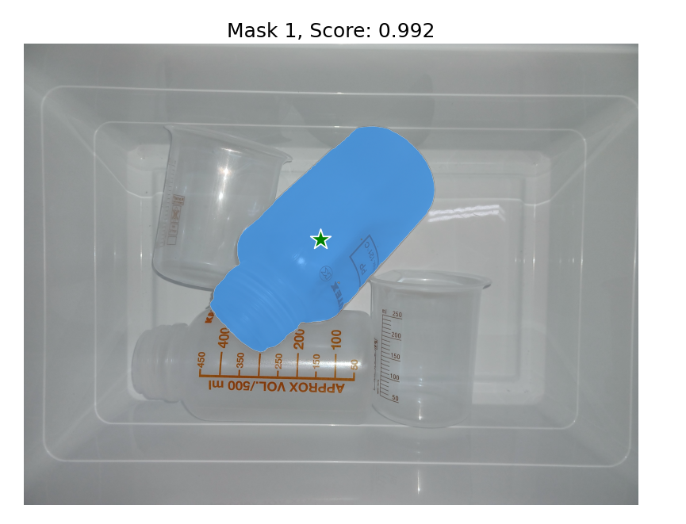

# SAM2-YOLO Project 🚀🖼️

Welcome to the **SAM2-YOLO Project** repository! 

This project combines the power of two state-of-the-art computer vision models—**SAM2** (Segment Anything Model 2) and **YOLO** (You Only Look Once)—to detect, localize, and segment bottles and beckers in images with high precision. Below, you'll find an overview of what the project does, how it works, and how to get started.

As you will probably notice, the ReadMe has been written with the help of the famous OpenAI child, **CHATGPT**! 

---

## **Project Overview** 🔍🛠️

This project achieves the following:
1. **Object Detection with YOLO:** 🕵️‍♂️
   - Detects objects in an input image using a pre-trained YOLO model.
   - Extracts bounding boxes, labels, and probabilities for the detected objects.
   - Selects the object with the highest confidence to segment it.

2. **Enhanced Image Preprocessing:**   🖼️✨
   - Performs contrast enhancement using CLAHE (Contrast Limited Adaptive Histogram Equalization) and other techniques.
   - Improves the input image quality for more accurate segmentation.

3. **Object Segmentation with SAM2:** ✂️
   - Refines the detection results by using SAM2 to predict high-quality segmentation masks.
   - Visualizes the segmented masks, bounding boxes, and input points.

4. **Integrated Visualization Tools:** 🎨
   - Provides visualization utilities to display masks, bounding boxes, and segmentation results on the input images.

---

## **Features**🌟

- ✅**Robust Object Detection:** Leverages YOLO to quickly and accurately transparent bottles and beckers objects in an image.
- ✅**Adaptive Segmentation:** Refines object boundaries using SAM2's powerful segmentation capabilities.
- ✅**Custom Visualization:** Includes tools to display masks, bounding boxes, and segmentation points in an intuitive manner.
- ✅**Enhanced Preprocessing:** Improves image quality for better detection and segmentation results.

---

## **Dependencies**📦🧩

### **Required Libraries:**
- Python 3.8+
- PyTorch
- OpenCV
- NumPy
- Matplotlib
- PIL (Pillow)
- [YOLO by Ultralytics](https://github.com/ultralytics/ultralytics)
- SAM2 and its utilities (provided in this repository)

---

## **Project Structure**🗂️

```
├── sam2/                                # SAM2 model and configuration
├── YOLO_tests/                          # YOLO model and tests
├── scripts/                             # Scripts to train YOLO and annotate images
├── data/                                # Images for training, validation and test
├── utils.py                             # Visualization functions for input points
└── Detection_and_Segmentation_main.py   # Main script for running detection and segmentation
```

---

## **Usage** ▶️🛠️

1. **Clone the repository:**
   ```bash
   git clone -b emilia_e_meglio_taffi git@github.com:ChristianCella/Regrasping_balordo.git
   cd Regrasping_balordo
   ```

2. **Install conda environment to run the project:**
    ```
    conda env create -f environment.yml
    ```

3. **Run the main script:**
   ```bash
    python Detection_and_Segmentation_main.py
   ```

## **Results** 📊📷
 






---

## **Acknowledgments**

This project builds upon the following technologies:
- **[YOLO](https://github.com/ultralytics/ultralytics):** State-of-the-art object detection framework.
- **[Segment Anything Model (SAM)](https://github.com/facebookresearch/sam2):** Cutting-edge model for general segmentation tasks.

---

## **License**

This repository is licensed under the [MIT License](LICENSE).

---

Feel free to explore, use, and extend this project! If you encounter any issues or have suggestions for improvement, please open an issue or submit a pull request. 🚀